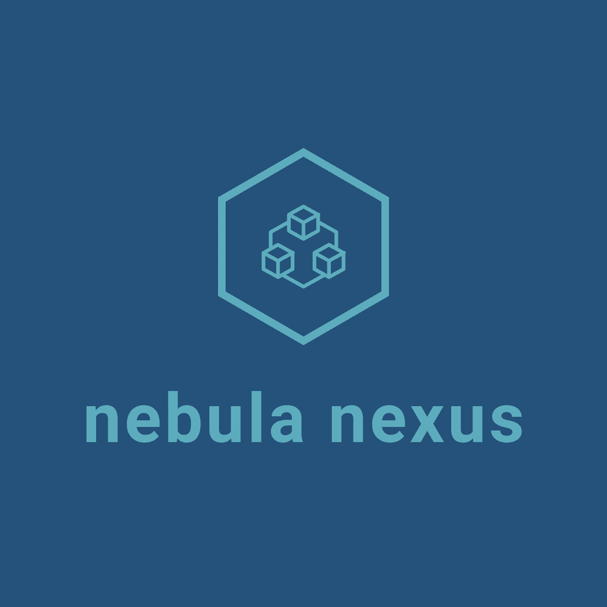

[](LICENSE)
[](https://github.com/subaquatic-pierre/fastpyfolio/issues)
[](https://github.com/subaquatic-pierre/fastpyfolio/stargazers)
[](https://github.com/subaquatic-pierre/fastpyfolio/network)

# FastPyFolio



## Project Overview

FastPyFolio is the home of my Website.


## Development

1. Start development

```
./docker-compose up
```

## Deployment

```
./deploy.sh $version
```
